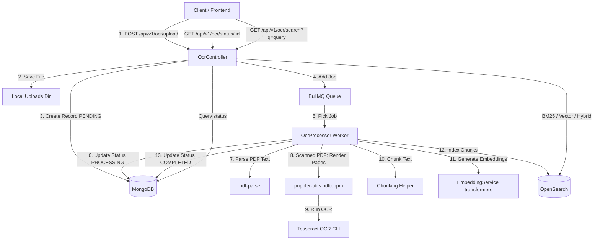

# Implementation Plan: OCR & Search System in OcrService

Develop a high-performance, asynchronous OCR and search pipeline for PDFs, images, and scanned documents in `OcrService`. The service uses NestJS, MongoDB (Mongoose), Redis (BullMQ), and OpenSearch.

## Proposed Architecture



---

## Proposed Changes

### [OcrService Component]

We will create and update the following files in the `OcrService` directory:

#### [MODIFY] [package.json](file:///d:/works/projects/services/OcrService/package.json)
- Add dependencies for:
  - `@nestjs/config` (environment configurations)
  - `@nestjs/mongoose` and `mongoose` (MongoDB state tracking)
  - `@nestjs/bullmq` and `bullmq` (background queue processing)
  - `@opensearch-project/opensearch` (OpenSearch indexing and search queries)
  - `pdf-parse` (direct PDF text parsing)
  - `@xenova/transformers` (local vector embedding generation for semantic search)
  - `class-validator` and `class-transformer` (controller validation)
  - Dev dependencies: `@types/pdf-parse`, `@types/multer`

#### [MODIFY] [Dockerfile](file:///d:/works/projects/services/OcrService/Dockerfile)
- Update Alpine build to install `poppler-utils` (for `pdftoppm` to convert PDFs to page images) and `tesseract-ocr` with English language package (`tesseract-ocr-data-eng`). This allows the container to perform OCR out-of-the-box in a highly secure, offline manner without depending on external API calls or dynamic WASM downloads.

#### [NEW] [local .env config](file:///d:/works/projects/services/OcrService/.env)
- Environment configuration for local development matching database, queue, and OpenSearch defaults.

#### [NEW] [configuration.ts](file:///d:/works/projects/services/OcrService/src/config/configuration.ts)
- Strong typings for environment variables loaded via NestJS `ConfigModule`.

#### [NEW] [document.schema.ts](file:///d:/works/projects/services/OcrService/src/database/schemas/document.schema.ts)
- MongoDB Schema to track document processing state (`PENDING`, `PROCESSING`, `COMPLETED`, `FAILED`), error details, file metadata, and extracted text organized by page.

#### [NEW] [embedding.service.ts](file:///d:/works/projects/services/OcrService/src/ocr/embedding.service.ts)
- Service wrapper for `@xenova/transformers` that loads a lightweight semantic embedding model (`Xenova/all-MiniLM-L6-v2`, 384 dimensions) to generate vector representations of text. Includes a config flag `ENABLE_VECTOR_SEARCH` to gracefully disable/mock vector generation if semantic search is disabled.

#### [NEW] [opensearch.service.ts](file:///d:/works/projects/services/OcrService/src/ocr/opensearch.service.ts)
- Handles OpenSearch interactions:
  - Automatically initializes indices with the correct settings and mappings.
  - Registers the `knn_vector` field (`embedding` with 384 dimensions using HNSW engine) when vector search is enabled.
  - Performs single-chunk indexing.
  - Implements searches:
    - **Keyword (BM25)**: Standard full-text query matching.
    - **Semantic (Vector)**: KNN vector query comparison.
    - **Hybrid**: Combined BM25 and KNN query scoring.

#### [NEW] [ocr.processor.ts](file:///d:/works/projects/services/OcrService/src/ocr/ocr.processor.ts)
- BullMQ queue consumer implementing the processing pipeline:
  1. Checks if document is a digital text-based PDF by parsing text directly with `pdf-parse`.
  2. If minimal or no text is parsed, handles it as a scanned PDF:
     - Converts PDF pages into images using `pdftoppm`.
     - Invokes the `tesseract` CLI command asynchronously for each page.
  3. If file is a standard image (JPEG, PNG), performs OCR on it directly using `tesseract` CLI.
  4. Organizes pages, cleans text, and splits it into overlapping chunks (e.g., 1000 characters, 200 characters overlap).
  5. Generates embeddings for each chunk (if vector search is active) and indexes the chunks into OpenSearch.
  6. Updates MongoDB document status and metadata.

#### [NEW] [ocr.service.ts](file:///d:/works/projects/services/OcrService/src/ocr/ocr.service.ts)
- Core service for the API layer: creates pending database records, schedules BullMQ processing jobs, retrieves status updates, and handles search requests.

#### [NEW] [ocr.controller.ts](file:///d:/works/projects/services/OcrService/src/ocr/ocr.controller.ts)
- Controller exposing API endpoints:
  - `POST /api/v1/ocr/upload` - Receives PDF or image via Multer, registers file, queues processing job, and returns document info.
  - `GET /api/v1/ocr/status/:id` - Returns processing status, pages, and errors.
  - `GET /api/v1/ocr/search` - Searches OCR content via query string (`q`) and search type (`keyword` | `semantic` | `hybrid`).

#### [NEW] [ocr.module.ts](file:///d:/works/projects/services/OcrService/src/ocr/ocr.module.ts)
- NestJS module orchestrating controllers, providers, schema registers, and queue definitions.

#### [MODIFY] [app.module.ts](file:///d:/works/projects/services/OcrService/src/app.module.ts)
- Integrates the new `OcrModule` along with NestJS `ConfigModule`, `MongooseModule` (MongoDB connection), and `BullModule` (Redis queue connection).

#### [MODIFY] [main.ts](file:///d:/works/projects/services/OcrService/src/main.ts)
- Standardizes global routing prefixes, registers global pipes (e.g. ValidationPipe), and configures request payload size configurations.

---

## Open Questions

> [!NOTE]
> 1. **Default language support**: We are installing the standard English data package (`tesseract-ocr-data-eng`). Should we support multi-language OCR dynamically or is English sufficient for this version?
> 2. **Text-based detection threshold**: To classify if a PDF is scanned vs. text-based, we look at the amount of extracted text. If it is less than 100 characters overall, we run OCR. Is this threshold suitable?

---

## Verification Plan

### Automated Tests
We will add unit/integration tests to verify the pipeline components:
- `EmbeddingService` vector generation correctness.
- `OcrProcessor` file flow routing (determining scanned vs. text-based).
- `OcrController` validation and routing endpoints.

Commands to execute tests:
```bash
npm run test
```

### Manual Verification
1. Build and start OcrService and its containers using Docker-compose.
2. Verify API endpoints using `curl` or Postman:
   - Upload a text-based PDF and confirm status changes to `COMPLETED` quickly without running `tesseract`.
   - Upload an image (e.g., JPEG/PNG screenshot containing text) and confirm status changes to `COMPLETED` after OCR.
   - Run a search query and verify results are returned from OpenSearch.
